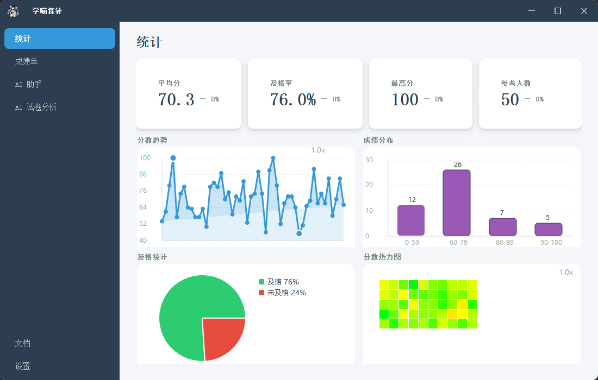

# MeowMetric 学喵探针


**AI 助力教育新模式** —— 本地题库 + AI 试卷/成绩分析桌面应用（原型）

[](LICENSE)
[](https://www.python.org/)
[](https://pypi.org/project/PyQt5/)

---
## 项目简介
**MeowMetric（学喵探针）** 是一款面向教育场景的桌面端 AI 助手，帮助教师和学生高效管理题库、分析试卷与成绩数据。

核心能力包括：
- **本地 RAG 题库问答**：基于 Ollama + ChromaDB，支持数学题（LaTeX）智能检索与流式解答
- **成绩数据分析**：导入 Excel 成绩单，自动生成统计卡片与可视化图表
- **试卷 AI 分析**：上传试卷图片，自动提取题目类型、知识点、难度、正确性与评价
- **多模态支持**：本地大模型与云端 API 双模式，兼顾隐私与能力
- **可自定义推理后端**：默认使用 Ollama + RAG，只需自行实现本地服务并修改配置文件即可切换任意推理应用
- **现代化桌面 UI**：基于 PyQt5 自研 UI Style + QtWebEngine，告别默认控件审美疲劳，支持流式回复与 MathJax 公式渲染

当前为**原型阶段**，功能持续完善中，已具备生产环境支持能力。

---
## 功能模块
| 模块 | 说明 |
|------|------|
| **仪表盘** | 平均分、及格率、最高分、学生总数统计；成绩走势折线图、分数段分布柱状图、及格/不及格饼图、成绩热力图 |
| **成绩分析** | 导入 Excel 成绩文件，选择分数列与满分，一键生成可视化报告，支持与上次结果对比趋势 |
| **智能问答** | 基于本地向量库的 RAG 问答，流式输出，支持思考过程解析与 LaTeX 公式渲染 |
| **试卷分析** | 上传试卷图片，AI 自动结构化提取题目信息（类型、知识点、难度、正误、评价） |
| **文档管理** | 管理本地题库文档（支持 .txt / .docx） |
| **设置** | 配置语言、云端 API、本地嵌入模型与请求地址 |

---
## 技术架构
```
MeowMetric/
├── main.py                 # 主入口，启动 UI 与 LLM 服务
├── services/
│   └── llm.py              # Flask 本地 AI 服务（SSE 流式接口）
├── libs/
│   ├── ui/                 # 基础 UI 组件与统计图表（自研 Style）
│   ├── graphics/           # 各功能页面（仪表盘、问答、试卷分析等）
│   ├── intelligence/       # AI 核心（RAG、Ollama、云端 OpenAI 兼容）
│   └── defer/              # 异步任务处理
├── resources/
│   ├── config.json         # 配置文件
│   ├── prompts/            # 提示词（中/英）
│   ├── languages/          # 多语言资源（.mo 编译文件）
│   ├── rag/                # 题库原始文档
│   └── chroma_rag/         # 向量数据库持久化目录
└── .github/
    └── app_show.png        # 应用截图
```

**主要技术栈**：
- **UI**：PyQt5 + 自研 UI Style + QtWebEngine（支持 Web 聊天界面与 MathJax），彻底摆脱默认控件审美疲劳
- **本地 AI**：Ollama（生成式模型 + 嵌入模型），支持通过配置轻松替换为任意自定义推理服务
- **RAG**：LangChain + ChromaDB，针对数学题做了 `\item` 切分优化
- **服务**：Flask + Waitress（生产级 WSGI 服务器）+ SSE 流式响应
- **云端**：OpenAI 兼容 API（可配置）
- **国际化**：支持 `.mo` 语言文件
- **数据处理**：pandas、LangChain 文档加载器
- **性能**：针对生产环境做了性能优化

---
## 环境要求
- Python 3.11+
- [Ollama](https://ollama.com/) 已安装并运行（默认 `localhost:11434`）—— 也可替换为其他自定义本地推理服务
- 推荐安装本地模型：
  - 生成式：任意支持的对话模型（如 `qwen2.5`、`llama3` 等）
  - 嵌入：`nomic-embed-text` / `bge-m3` / `qwen3-embedding` 等

---
## 快速开始
### 1. 克隆仓库
```bash
git clone https://github.com/HeavyNotFat/MeowMetric.git
cd MeowMetric
```

### 2. 安装依赖
建议使用虚拟环境：
```bash
python -m venv venv
# Windows
venv\Scripts\activate
# Linux / macOS
source venv/bin/activate
pip install -r requirements.txt
```

### 3. 配置
编辑 `resources/config.json`：
```json
{
  "language": "zh_CN",
  "cloud_api_base_url": "你的云端 API Base URL",
  "cloud_api_key": "你的 API Key",
  "model_request": "http://localhost:5000",
  "cloud_model": "你的云端模型名",
  "embed_model": "qwen3-embedding:4b"
}
```
> 注意：请勿将真实 API Key 提交到公开仓库。

**自定义推理后端**：  
只需实现兼容的本地服务接口，并修改 `model_request` 等配置项即可切换，无需改动核心代码（默认仍为 Ollama + RAG）。

### 4. 准备题库（可选）
将 `.txt` 或 `.docx` 题库文件放入 `resources/rag/` 目录。  
系统会自动构建向量库（支持数学题按 `\item` 智能切分）。

### 5. 启动
确保 Ollama（或你的自定义推理服务）已启动，然后运行：
```bash
python main.py
```
程序会自动拉起本地 LLM 服务（端口 5000），并打开桌面窗口。

---
## 主要接口说明（本地服务）
| 接口 | 方法 | 说明 |
|------|------|------|
| `/api/ai/local` | POST | 本地模型流式问答（支持图片多模态） |
| `/api/ai/cloud` | POST | 云端试卷分析 |
| `/api/get_model_lists` | POST | 获取本地 Ollama 已安装模型列表（SSE） |

---
## 目录与数据说明
- `resources/rag/`：原始题库文档
- `resources/chroma_rag/`：向量库持久化（自动管理版本，模型变更时重建）
- `resources/languages/`：多语言 `.mo` 编译文件
- `.测试数据/`：测试用数据（可选）

---
## 开发说明
- 当前版本为**原型**，代码结构仍在演进，已具备生产环境支持（Waitress + `.mo` 语言文件 + 性能优化）
- 支持中文界面（`zh_CN`），提示词与翻译资源位于 `resources/`
- 流式回复支持 `<think>...</think>` 标签解析
- 试卷分析结果强制要求纯 JSON 输出
- UI 采用自研 PyQt5 Style，视觉与交互体验经过针对性打磨

---
## 许可证
本项目采用 [GNU General Public License v3.0](LICENSE) 开源。

---
## 致谢
- [Ollama](https://ollama.com/)
- [LangChain](https://www.langchain.com/)
- [PyQt](https://www.riverbankcomputing.com/software/pyqt/)
- 以及所有为教育 AI 工具贡献力量的开发者

---
**MeowMetric · 学喵探针** —— 让 AI 真正走进日常教与学。
